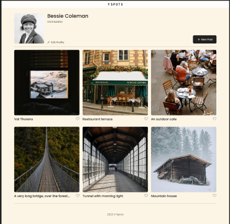

# 📸 Insta-Spot

Welcome to **Insta-Spot** – a modern, responsive photo-sharing web app inspired by the best of Instagram and Pinterest.

Originally, this project began as a collaborative effort using **HTML**, **CSS**, and **JavaScript**. I later rebuilt it from the ground up in **React** to take advantage of component-based architecture and a smoother user experience.

## ✨ Preview



---

## 🚀 About the Project

This project was first introduced as a group assignment at AltSchool Africa’s Tinyuka School of Engineering, guided by [Mr. Oluwasetemi Ojo](https://github.com/Oluwasetemi). After our team completed the initial version, we were each challenged to convert it into a fully functional React application.

> **Initial goal:** Build a profile page with a photo grid, enable editing the profile, allow users to add new posts, and make images previewable in a modal – all as a team.
>
> **Next step:** Reimagine and implement the project as a React app, adding my own improvements and style.

<!-- ### 🌐 Live Demo

Check out the live version here:  
🔗 [Insta-Spot on Pipeops](https://spots.pipeops.net/) -->

---

## 🛠️ Tech Stack

- **React** (with Vite)
- **Tailwind CSS** (utility-first styling)
- **JavaScript** (ES6+)
- **CSS3** (Flexbox & Grid)

---

## 📦 Features

- 👤 **User Profile:** Customizable name, description, and avatar
- ➕ **Add New Post:** Upload an image and give it a title
- ✏️ **Edit Profile:** Update your profile details and photo
- 🖼️ **Responsive Gallery:** Dynamic grid layout for all devices
- ❤️ **Like Button:** Like/unlike posts with interactive icons
- 📱 **Mobile-First:** Fully responsive and touch-friendly

---

## 🖥️ Getting Started

To run this project locally:

```bash
# Clone the repository
git clone https://github.com/your-username/insta-spot.git

# Move into the project directory
cd insta-spot

# Install dependencies
npm install

# Start the development server
npm run dev

```
---

| 🖥️ Desktop View                | 📱 Mobile View               |
| ------------------------------ | ---------------------------- |
|  |  |

--- 

## 👥 Team

A team of _10 passionate learners_ from **AltSchool Africa Tinyuka School of Enginnering**, collaborated on the first version of this project.

- Reuben Agbor
- Ejiro Francess Ejoh
- Busari Olanrewaju
- Esther Oluwatimilehin
- Elinah Mmbone
- Salaudeen Rukayat Temitope
- Doris Senyah Afriyie
- Adebomi Omodolapo Ademola
- O-Oluyomi Boluwatife
- Lateefat Bello

---

## 🙏 Acknowledgements

Special thanks to:

- **AltSchool Africa** – for providing a strong foundation in frontend development
- **[Mr. Oluwasetemi Ojo](https://github.com/Oluwasetemi)** – our supportive instructor for the Tinyuka Frontend track
